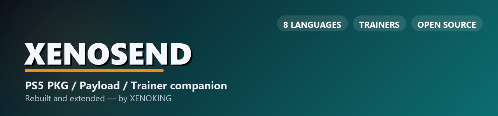

  

  
  
  
  

<b>Made by <a href="https://github.com/XENOKING123">XENOKING</a></b> · a rebuilt and extended PS5 companion

---

## What this is

**XenoSend** is a PS5 companion app for Windows. Send PKGs and homebrew payloads, run the local exploit host, update the console's YouTube app, back up Y2JB, and browse and toggle game trainers, all from one window. It builds on **sendpp** v1.4.0 by **PSMacedo** and extends it with:

- 🖥️ **A new 1280×820 desktop interface** — animated game-art showcase, a payload library grouped by GitHub source, and a quick-start Auto-Load
- 🕹️ **Trainers** — browse a 2,000+ game cheat library with real cover art; **Attach** to a running game and toggle cheats live through [CheatRunner](https://github.com/notmaj0r/CheatRunner) (green/red status per cheat, Disable all), or **Detach** and go back to browsing
- ⭐ **Your own library** — favorite games, build collections, add your own private cheats (title, author, cover image), and attach cheat files (`.json` / `.shn` / `.mc4`) to any game
- 💾 **Installed games** — see the games and apps CheatRunner finds on your console and jump straight to their cheats
- 🔗 **Host / ReLapse** — start and stop the local exploit host (HTTPS + DNS) and see when your PS5 connects
- ⚡ **Auto-Load** — one click sends `kstuff` then `CheatRunner` in the right order, with the pacing each needs
- 📦 **PKG Installer, YouTube update + account activation, Y2JB Backup** — everything the original app did
- 🎨 **Colour themes and a display name** — five accent themes, saved between launches
- 🌍 **8 languages** — English, Português, العربية, Español, Français, Deutsch, Türkçe, Русский
- 🔔 **Update notifications** — a banner plus a manual "Check for updates" in Settings, pointed at this repo's releases

## Download

Grab `XenoSend-windows.exe` (just run it) or `XenoSend-android.apk` (sideload) from **[Releases](../../releases/latest)**. Windows needs the Microsoft Edge WebView2 runtime (already installed on current Windows 10/11).

## Trainers — how it works

- The game list, cheat names, and cover art come from the community cheat database, sourced from the **etaHEN PS5 Cheats** and **HEN Cheats Collection** repositories via the etaHEN and GoldHEN communities. Thanks to **LM** (lightningmods), **Buzzer** (buzzer-re), **Super Death**, the **GoldHEN Team**, **Yharnam**, **PS4Trainer**, and every cheat creator in the scene. XenoSend doesn't create cheats — it bundles and applies the community's work. Report cheat-specific issues to the original authors.
- Live toggling talks to **[CheatRunner](https://github.com/notmaj0r/CheatRunner)** by **maj0r** (Discord: `callmemaj0r`), the open web API that runs on your PS5 once you've sent it. XenoSend can load it for you from **Auto-Load**, together with `kstuff`.

## Credits

| | |
|---|---|
| **Original sendpp (PS5 Send PKG/Payload)** | PSMacedo — XenoSend is an independent project built on it and is not affiliated with the original author |
| **CheatRunner** | [maj0r](https://github.com/notmaj0r) |
| **Cheat database** | etaHEN PS5 Cheats, HEN Cheats Collection, and the etaHEN/GoldHEN communities — LM, Buzzer, Super Death, GoldHEN Team, Yharnam, PS4Trainer, and all cheat creators in the scene |
| **kstuff** | [EchoStretch](https://github.com/EchoStretch) |
| **ReLapse / Host Local exploit assets** | bundled unmodified from their original community sources |
| **Interface, translations, theming & Trainers** | [XENOKING](https://github.com/XENOKING123) |

## Disclaimer

For use on jailbroken PS5 consoles you own, for homebrew and backup purposes, at your own risk. This project is not affiliated with or endorsed by Sony Interactive Entertainment, PSMacedo, maj0r, or any cheat-database contributor; all trademarks belong to their respective owners. The bundled community cheat database, cover art, and third-party exploit/payload assets remain the work and property of their original authors and are included under their own terms.

---

⭐ If XenoSend is useful, a star helps more than you'd think.

